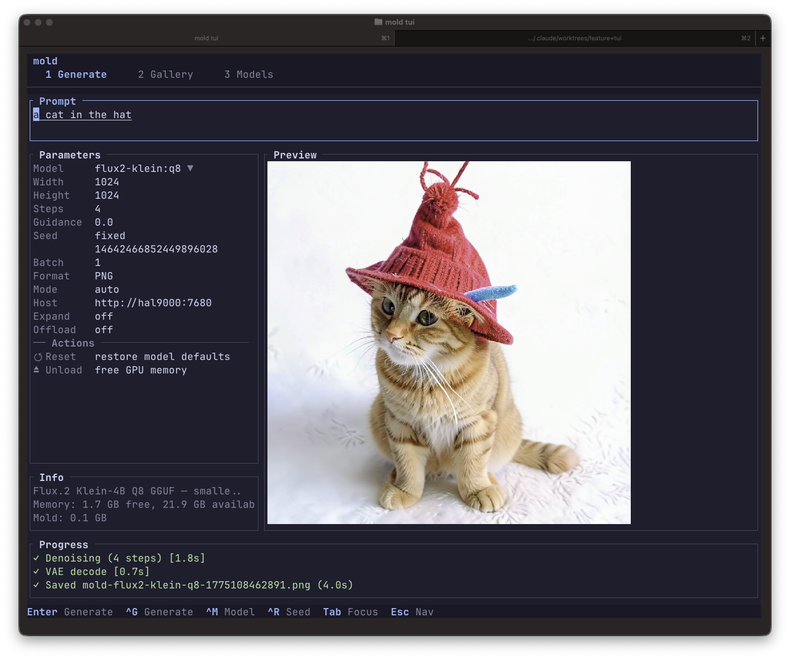

# mold

[](https://github.com/utensils/mold/actions/workflows/ci.yml)
[](https://codecov.io/gh/utensils/mold)
[](https://flakehub.com/flake/utensils/mold)
[](https://www.rust-lang.org)
[](https://nixos.wiki/wiki/Flakes)

Generate images and short video clips on your own GPU. No cloud, no Python, no fuss.

**[Documentation](https://utensils.github.io/mold/)** | **[Getting Started](https://utensils.github.io/mold/guide/)** | **[Models](https://utensils.github.io/mold/models/)** | **[API](https://utensils.github.io/mold/api/)**

```bash
mold run "a cat riding a motorcycle through neon-lit streets"
```

That's it. Mold auto-downloads the model on first run and saves the image to your current directory.

## Install

```bash
curl -fsSL https://raw.githubusercontent.com/utensils/mold/main/install.sh | sh
```

This downloads the latest pre-built binary to `~/.local/bin/mold`. On Linux, the installer auto-detects your NVIDIA GPU and picks the right binary (RTX 40-series or RTX 50-series). macOS builds include Metal support.

<details>
<summary>Other install methods</summary>

### Nix

```bash
nix run github:utensils/mold -- run "a cat"                   # Ada / RTX 40-series
nix run github:utensils/mold#mold-sm120 -- run "a cat"        # Blackwell / RTX 50-series
```

### From source

```bash
cargo build --release -p mold-ai --features cuda    # Linux (NVIDIA)
cargo build --release -p mold-ai --features metal   # macOS (Apple Silicon)
```

Add `preview`, `expand`, `discord`, or `tui` to the features list as needed.

### Manual download

Pre-built binaries on the [releases page](https://github.com/utensils/mold/releases).

</details>

## Usage

```bash
mold run "a sunset over mountains"                    # Generate with default model
mold run flux-dev:q4 "a turtle in the desert"         # Pick a model
mold run "a portrait" --width 768 --height 1024       # Custom size
mold run "a sunset" --batch 4 --seed 42               # Batch with reproducible seeds
mold run "oil painting" --image photo.png              # img2img
mold run qwen-image-edit-2511:q4 "make the chair red leather" --image chair.png --image swatch.png
mold run ltx-video-0.9.6-distilled:bf16 "a fox in the snow" --frames 25
mold run "a cat" --expand                              # LLM prompt expansion
mold run qwen-image:q2 "a poster" --qwen2-variant q6  # Qwen-Image quantized text encoder
mold run flux-dev:bf16 "portrait" --lora style.safetensors  # LoRA adapter
```

### Inline preview

Display generated images directly in the terminal (requires `preview` feature):

```bash
mold run "a cat" --preview
```

<p align="center">
  
  <br/>
  <em>Generating the mold logo with <code>--preview</code> in Ghostty</em>
</p>

### Piping

```bash
mold run "neon cityscape" | viu -                     # Pipe to image viewer
echo "a cat" | mold run flux-schnell                  # Pipe prompt from stdin
```

### Terminal UI (beta)

```bash
mold tui
```

<p align="center">
  
  <br/>
  <em>The TUI Generate view with Kitty graphics protocol image preview in Ghostty</em>
</p>

### Model management

```bash
mold list                    # See what you have
mold pull flux-dev:q4        # Download a model
mold rm dreamshaper-v8       # Remove a model
mold stats                   # Disk usage overview
mold clean                   # Clean orphaned files (dry-run)
mold clean --force           # Actually delete
```

### Remote rendering

```bash
# On your GPU server
mold serve

# From your laptop
MOLD_HOST=http://gpu-server:7680 mold run "a cat"
```

See the full [CLI reference](https://utensils.github.io/mold/guide/cli-reference), [configuration guide](https://utensils.github.io/mold/guide/configuration), and [model catalog](https://utensils.github.io/mold/models/) in the documentation.

## Models

Supports 11 model families with 80+ variants:

| Family              | Models                     | Highlights                                                       |
| ------------------- | -------------------------- | ---------------------------------------------------------------- |
| **FLUX.1**          | schnell, dev, + fine-tunes | Best quality, 4-25 steps, LoRA support                           |
| **Flux.2 Klein**    | 4B and 9B                  | Fast 4-step, low VRAM, default model                             |
| **SDXL**            | base, turbo, + fine-tunes  | Fast, flexible, negative prompts                                 |
| **SD 1.5**          | base + fine-tunes          | Lightweight, ControlNet support                                  |
| **SD 3.5**          | large, medium, turbo       | Triple encoder, high quality                                     |
| **Z-Image**         | turbo                      | Fast 9-step, Qwen3 encoder                                       |
| **Qwen-Image**      | base + 2512                | High resolution, CFG guidance, GGUF quant support                |
| **Qwen-Image-Edit** | 2511                       | Multimodal image editing, repeatable `--image`, negative prompts |
| **Wuerstchen**      | v2                         | 42x latent compression                                           |
| **LTX-2 / LTX-2.3** | 19B, 22B                   | Joint audio-video generation, MP4-first workflows                |
| **LTX Video**       | 0.9.6, 0.9.8               | Text-to-video with APNG/GIF/WebP/MP4 output                      |

Bare names auto-resolve: `mold run flux-schnell "a cat"` picks the best available variant.

See the full [model catalog](https://utensils.github.io/mold/models/) for sizes, VRAM requirements, and recommended settings.

### LTX Video

Current supported LTX checkpoints are:

- `ltx-video-0.9.6:bf16`
- `ltx-video-0.9.6-distilled:bf16`
- `ltx-video-0.9.8-2b-distilled:bf16`
- `ltx-video-0.9.8-13b-dev:bf16`
- `ltx-video-0.9.8-13b-distilled:bf16`

Recommended default today: `ltx-video-0.9.6-distilled:bf16`.

The `0.9.8` models pull the required spatial-upscaler asset automatically and
now run the full multiscale refinement path. mold keeps the shared T5 assets
under `shared/flux/...`, stores the `0.9.8` spatial upscaler under
`shared/LTX-Video/...`, and intentionally continues using the compatible
`LTX-Video-0.9.5` VAE source until the newer VAE layout is ported.

### LTX-2 / LTX-2.3

Current supported LTX-2 checkpoints are:

- `ltx-2-19b-dev:fp8`
- `ltx-2-19b-distilled:fp8`
- `ltx-2.3-22b-dev:fp8`
- `ltx-2.3-22b-distilled:fp8`

Recommended default today: `ltx-2-19b-distilled:fp8`.

This family is separate from `ltx-video`: it defaults to MP4, supports
synchronized audio, audio-to-video, keyframe interpolation, retake workflows,
stacked LoRAs, and camera-control LoRAs. The implementation is native Rust in
`mold-inference` with no Python bridge or upstream checkout requirement. CUDA
is the supported backend for real local generation, CPU is a correctness-only
fallback, and Metal is explicitly unsupported for this family. On 24 GB Ada
GPUs such as the RTX 4090, mold uses native staged loading, layer streaming,
and the compatible `fp8-cast` path for local FP8 runs rather than Hopper-only
`fp8-scaled-mm`. The native CUDA acceptance matrix is now validated across 19B
and 22B text+audio-video, image-to-video, audio-to-video, keyframe, retake,
public IC-LoRA, spatial upscaling (`x1.5` / `x2` where published), and
temporal upscaling (`x2`). The shared Gemma text assets are gated on Hugging
Face, so `mold pull` requires approved access to
`google/gemma-3-12b-it-qat-q4_0-unquantized`.

## Features

- **txt2img, img2img, multimodal edit, inpainting** — full generation pipeline
- **Image upscaling** — Real-ESRGAN super-resolution (2x/4x) via `mold upscale`, server API, or TUI
- **LoRA adapters** — FLUX BF16 and GGUF quantized
- **ControlNet** — canny, depth, openpose (SD1.5)
- **Prompt expansion** — local LLM (Qwen3-1.7B) enriches short prompts
- **Negative prompts** — CFG-based models (SD1.5, SDXL, SD3, Wuerstchen)
- **Pipe-friendly** — `echo "a cat" | mold run | viu -`
- **PNG metadata** — embedded prompt, seed, model info
- **Terminal preview** — Kitty, Sixel, iTerm2, halfblock
- **Smart VRAM** — quantized encoders, block offloading, drop-and-reload
- **Qwen family encoder control** — selectable Qwen2.5-VL variants for Qwen-Image and Qwen-Image-Edit, with quantized auto-fallback when BF16 would be too heavy
- **Shell completions** — bash, zsh, fish, elvish, powershell
- **REST API** — `mold serve` with SSE streaming, auth, rate limiting
- **Discord bot** — slash commands with role permissions and quotas
- **Interactive TUI** — generate, gallery, models, settings

## Deployment

| Method              | Guide                                                                   |
| ------------------- | ----------------------------------------------------------------------- |
| **NixOS module**    | [Deployment: NixOS](https://utensils.github.io/mold/deployment/nixos)   |
| **Docker / RunPod** | [Deployment: Docker](https://utensils.github.io/mold/deployment/docker) |
| **Systemd**         | [Deployment: Overview](https://utensils.github.io/mold/deployment/)     |

## How it works

Single Rust binary built on [candle](https://github.com/huggingface/candle) for the in-tree model families. LTX-2 now runs through the native Rust stack in `mold-inference`, so the full model surface stays in Rust with no libtorch dependency.

```
mold run "a cat"
  │
  ├─ Server running? → send request over HTTP
  │
  └─ No server? → load model locally on GPU
       ├─ Encode prompt (T5/CLIP text encoders)
       ├─ Denoise latent (transformer/UNet)
       ├─ Decode pixels (VAE)
       └─ Save PNG
```

## Requirements

- **NVIDIA GPU** with CUDA or **Apple Silicon** with Metal
- Models auto-download on first use (~2-30GB depending on model)
