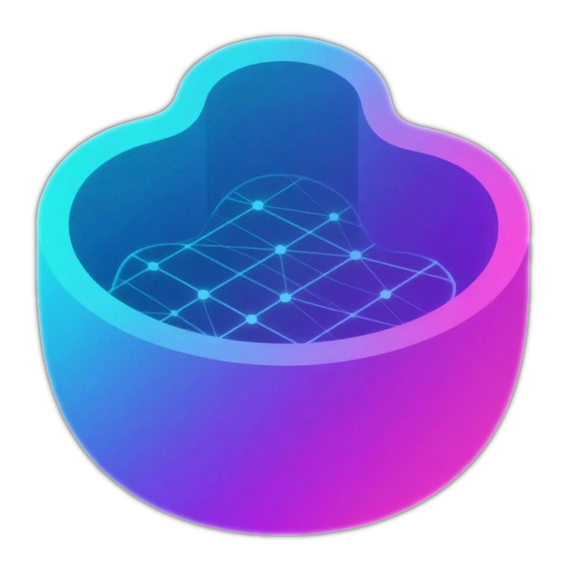
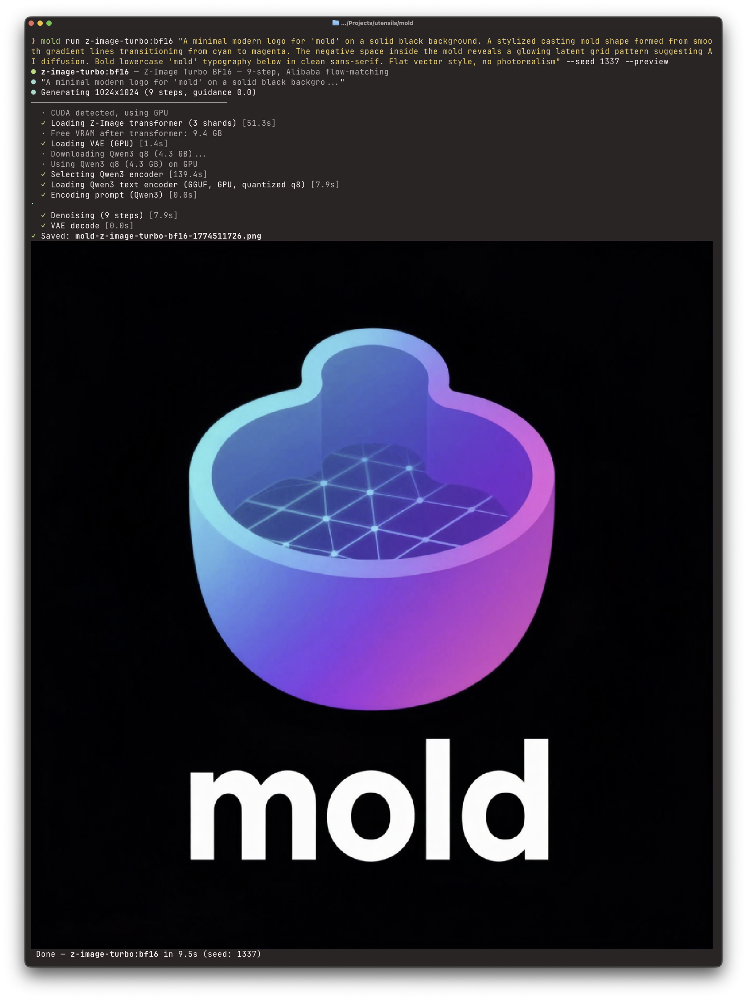

# mold

[](https://github.com/utensils/mold/actions/workflows/ci.yml)
[](https://www.rust-lang.org)
[](https://nixos.wiki/wiki/Flakes)

<p align="center">
  
</p>

Generate images from text on your own GPU. No cloud, no Python, no fuss.

**[Documentation](https://utensils.github.io/mold/)** | **[Getting Started](https://utensils.github.io/mold/guide/)** | **[Models](https://utensils.github.io/mold/models/)** | **[API](https://utensils.github.io/mold/api/)**

```bash
mold run "a cat riding a motorcycle through neon-lit streets"
```

That's it. Mold auto-downloads the model on first run and saves the image to your current directory.

## Install

```bash
curl -fsSL https://raw.githubusercontent.com/utensils/mold/main/install.sh | sh
```

This downloads the latest pre-built binary to `~/.local/bin/mold`. On Linux, the installer auto-detects your NVIDIA GPU and picks the right binary (RTX 40-series or RTX 50-series). macOS builds include Metal support. Override with `MOLD_CUDA_ARCH=sm120` for Blackwell or `MOLD_CUDA_ARCH=sm89` for Ada.

<details>
<summary>Other install methods</summary>

### Nix

```bash
# Run directly — no install needed (default: Ada/RTX 40-series)
nix run github:utensils/mold -- run "a cat"

# Blackwell / RTX 50-series
nix run github:utensils/mold#mold-sm120 -- run "a cat"

# Or add to your system
nix profile install github:utensils/mold          # Ada (sm_89)
nix profile install github:utensils/mold#mold-sm120  # Blackwell (sm_120)
```

### From source

```bash
cargo build --release -p mold-ai --features cuda    # Linux (NVIDIA)
cargo build --release -p mold-ai --features metal   # macOS (Apple Silicon)
```

Optional features can be added to the same build, for example
`--features cuda,preview,expand,discord` or
`--features metal,preview,expand,discord` if you also want terminal preview,
local prompt expansion, or the Discord bot commands.

### Manual download

Pre-built binaries are available on the [releases page](https://github.com/utensils/mold/releases).

| Platform | File |
|----------|------|
| macOS Apple Silicon (Metal) | `mold-aarch64-apple-darwin.tar.gz` |
| Linux x86_64 (Ada, RTX 4090 / 40-series) | `mold-x86_64-unknown-linux-gnu-cuda-sm89.tar.gz` |
| Linux x86_64 (Blackwell, RTX 5090 / 50-series) | `mold-x86_64-unknown-linux-gnu-cuda-sm120.tar.gz` |

</details>

## Usage

```bash
# Generate an image
mold run "a sunset over mountains"

# Pick a model
mold run flux-dev:q4 "a turtle in the desert"
mold run sdxl-turbo "espresso in a tiny cup"
mold run dreamshaper-v8 "fantasy castle on a cliff"

# Reproducible results (the logo above was generated this way)
mold run z-image-turbo:bf16 "A minimal modern logo for 'mold' on a solid black background. A stylized casting mold shape formed from smooth gradient lines transitioning from cyan to magenta. The negative space inside the mold reveals a glowing latent grid pattern suggesting AI diffusion. Bold lowercase 'mold' typography below in clean sans-serif. Flat vector style, no photorealism" --seed 1337

# Custom size and steps
mold run "a portrait" --width 768 --height 1024 --steps 30
```

### Piping

Mold is pipe-friendly in both directions. When stdout is not a terminal, raw image bytes go to stdout and status/progress goes to stderr.

```bash
# Pipe output to an image viewer
mold run "neon cityscape" | viu -

# Pipe prompt from stdin
echo "a cat riding a motorcycle" | mold run flux-schnell

# Chain with other tools
cat prompt.txt | mold run z-image-turbo --seed 42 | convert - -resize 512x512 thumbnail.png

# Pipe in and out
echo "cyberpunk samurai" | mold run flux-dev:q4 | viu -
```

### Output metadata

PNG output embeds generation metadata by default, including prompt, model, seed, size, steps, and a JSON `mold:parameters` chunk for downstream tools.

```bash
# Disable metadata for one run
mold run "a cat" --no-metadata

# Disable metadata globally via environment
MOLD_EMBED_METADATA=0 mold run "a cat"
```

### Inline preview

Display generated images directly in the terminal after generation (requires building with `--features preview`). Auto-detects the best terminal protocol: Kitty graphics, iTerm2, Sixel, or Unicode half-block fallback.

```bash
# Preview after generation
mold run "a cat" --preview

# Enable preview permanently via environment
export MOLD_PREVIEW=1
```

<p align="center">
  
  <br/>
  <em>Generating the mold logo with <code>--preview</code> in Ghostty</em>
</p>

In `~/.mold/config.toml` (or `$MOLD_HOME/config.toml`):

```toml
embed_metadata = false
```

### Image-to-image

Transform existing images with a text prompt. Source images auto-resize to fit the target model's native resolution (preserving aspect ratio), so you don't need to worry about dimension mismatches or OOM errors.

```bash
# Stylize a photo
mold run "oil painting style" --image photo.png

# Control how much changes (0.0 = no change, 1.0 = full denoise)
mold run "watercolor" --image photo.png --strength 0.5

# Pipe an image through
cat photo.png | mold run "sketch style" --image - | viu -

# Override auto-resize with explicit dimensions
mold run "pencil sketch" --image photo.png --width 768 --height 512
```

### Inpainting

Selectively edit parts of an image with a mask (white = repaint, black = keep):

```bash
mold run "a red sports car" --image photo.png --mask mask.png
```

### LoRA adapters (FLUX)

Apply LoRA adapter weights to customize model output (BF16 and GGUF quantized):

```bash
# LoRA adapter (FLUX BF16 or GGUF)
mold run flux-dev:bf16 "a portrait" --lora style.safetensors --lora-scale 0.8
mold run flux-dev:q4 "a portrait" --lora style.safetensors --lora-scale 0.8
```

### ControlNet (SD1.5)

Guide generation with a control image (edge map, depth map, etc.):

```bash
mold pull controlnet-canny-sd15
mold run sd15:fp16 "a futuristic city" --control edges.png --control-model controlnet-canny-sd15
```

### Negative prompts

Guide what the model should avoid generating. Works with CFG-based models (SD1.5, SDXL, SD3, Wuerstchen); ignored by FLUX and other flow-matching models.

```bash
# Specify a negative prompt
mold run sd15:fp16 "a portrait" -n "blurry, watermark, ugly, bad anatomy"
mold run sdxl:fp16 "a landscape" --negative-prompt "low quality, jpeg artifacts"

# Override config default with empty unconditional
mold run sd15:fp16 "a cat" --no-negative
```

Negative prompts can also be set in `config.toml` as per-model or global defaults:

```toml
# Global default for all CFG models
default_negative_prompt = "low quality, worst quality, blurry, watermark"

[models."sd15:fp16"]
# Per-model override (takes precedence over global)
negative_prompt = "worst quality, low quality, bad anatomy, bad hands, extra fingers, blurry"

[models."flux-dev:bf16"]
# LoRA adapter (FLUX BF16 or GGUF quantized)
# lora = "/path/to/adapter.safetensors"
# lora_scale = 0.8
```

Precedence: CLI `--negative-prompt` > per-model config > global config > empty string.

### Scheduler selection

Choose the noise scheduler for SD1.5/SDXL models:

```bash
mold run sd15:fp16 "a cat" --scheduler uni-pc        # Fast convergence
mold run sd15:fp16 "a cat" --scheduler euler-ancestral # Stochastic
```

### Batch generation

Generate multiple images with incrementing seeds:

```bash
mold run "a sunset" --batch 4    # Generates 4 images: seed, seed+1, seed+2, seed+3
```

### Prompt expansion

Expand short prompts into richly detailed image generation prompts using a local LLM (Qwen3-1.7B, ~1.8GB). The model auto-downloads on first use and is dropped from memory before diffusion runs.

```bash
# Preview what expansion produces
mold expand "a cat"

# Multiple variations
mold expand "cyberpunk city" --variations 5

# Generate with expansion
mold run "a cat" --expand

# Batch + expand: each image gets a unique expanded prompt
mold run "a sunset" --expand --batch 4

# Use an external OpenAI-compatible API instead of local LLM
mold run "a cat" --expand --expand-backend http://localhost:11434/v1
```

Set `MOLD_EXPAND=1` to enable expansion by default. Use `--no-expand` to override.

#### Custom expansion prompts

The system prompt templates and per-model-family word limits can be customized in `~/.config/mold/config.toml`:

```toml
[expand]
enabled = true
model = "qwen3-expand:q8"

# Override the single-expansion system prompt template.
# Available placeholders: {WORD_LIMIT}, {MODEL_NOTES}
# system_prompt = "You are an image prompt writer. Keep under {WORD_LIMIT} words. {MODEL_NOTES}"

# Override the batch-variation system prompt template.
# Available placeholders: {N}, {WORD_LIMIT}, {MODEL_NOTES}
# batch_prompt = "Generate {N} distinct image prompts under {WORD_LIMIT} words each. {MODEL_NOTES}"

# Override per-family word limits and style notes.
# Families: sd15, sdxl, wuerstchen, flux, sd3, z-image, flux2, qwen-image
[expand.families.sd15]
word_limit = 50
style_notes = "SD 1.5 uses CLIP-L (77 tokens). Use comma-separated keyword phrases."

[expand.families.flux]
word_limit = 200
style_notes = "Write rich, descriptive natural language with atmosphere and mood."
```

Templates can also be set via environment variables: `MOLD_EXPAND_SYSTEM_PROMPT`, `MOLD_EXPAND_BATCH_PROMPT`.

### Manage models

```bash
mold pull flux-schnell:q8    # Download a model
mold list                    # See what you have
mold info                    # Installation overview
mold info flux-dev:q4        # Model details + disk usage
mold rm dreamshaper-v8       # Remove a model
```

### Hugging Face auth

Some model repos on Hugging Face require an authenticated read token. `mold`
checks `HF_TOKEN` automatically when downloading model files, and falls back to
the token saved by `huggingface-cli login` if present.

```bash
# Local pulls / first-run auto-download
export HF_TOKEN=hf_...
mold pull flux-dev:q4

# Remote server pulls: set the token where mold serve is running
HF_TOKEN=hf_... mold serve
MOLD_HOST=http://gpu-server:7680 mold pull flux-dev:q4
```

If a gated repo still returns 401/403, make sure you have accepted that model's
license on Hugging Face and that the token has at least read access.

### Remote rendering

Run mold on a beefy GPU server, generate from anywhere:

```bash
# On your GPU server
mold serve

# From your laptop
MOLD_HOST=http://gpu-server:7680 mold run "a cat"
```

### Server image persistence

Save a copy of every server-generated image to disk (disabled by default):

```bash
# Via environment variable
MOLD_OUTPUT_DIR=/srv/mold/gallery mold serve

# Via config file
# output_dir = "/srv/mold/gallery"
```

Images are saved alongside the normal HTTP response using the same naming convention as the CLI (`mold-{model}-{timestamp}.{ext}`). Save failures log a warning but never fail the request.

## Configuration

Mold looks for `config.toml` inside the base mold directory (`~/.mold/` by default). Override the base with `MOLD_HOME`:

```bash
export MOLD_HOME=/data/mold    # config at /data/mold/config.toml, models at /data/mold/models/
```

Key environment variables (highest precedence, override config file):

| Variable | Default | Description |
|----------|---------|-------------|
| `MOLD_HOME` | `~/.mold` | Base directory for config, cache, and default model storage |
| `MOLD_DEFAULT_MODEL` | `flux-schnell` | Default model (smart fallback to only downloaded model) |
| `MOLD_HOST` | `http://localhost:7680` | Remote server URL |
| `MOLD_MODELS_DIR` | `$MOLD_HOME/models` | Model storage directory |
| `MOLD_OUTPUT_DIR` | — | Save server-generated images to this directory (disabled by default) |
| `MOLD_LOG` | `warn` / `info` | Log level |
| `MOLD_PORT` | `7680` | Server port |
| `MOLD_EAGER` | — | Set `1` to keep all model components loaded simultaneously |
| `MOLD_OFFLOAD` | — | Set `1` to force CPU↔GPU block streaming (reduces VRAM, slower) |
| `MOLD_EMBED_METADATA` | `1` | Set `0` to disable PNG metadata |
| `MOLD_PREVIEW` | — | Set `1` to display generated images inline in the terminal |
| `MOLD_T5_VARIANT` | `auto` | T5 encoder: auto/fp16/q8/q6/q5/q4/q3 |
| `MOLD_QWEN3_VARIANT` | `auto` | Qwen3 encoder: auto/bf16/q8/q6/iq4/q3 |
| `MOLD_SCHEDULER` | — | Noise scheduler for SD1.5/SDXL: ddim/euler-ancestral/uni-pc |
| `MOLD_CORS_ORIGIN` | — | Restrict CORS to specific origin |
| `MOLD_TEXT_TOKENIZER_PATH` | — | Override generic text tokenizer path (Qwen/Z-Image families) |
| `MOLD_DECODER_PATH` | — | Override decoder weights path (Wuerstchen) |
| `MOLD_EXPAND` | — | Set `1` to enable LLM prompt expansion by default |
| `MOLD_EXPAND_BACKEND` | `local` | Expansion backend: `local` or OpenAI-compatible API URL |
| `MOLD_EXPAND_MODEL` | `qwen3-expand:q8` | LLM model for local expansion |
| `MOLD_EXPAND_TEMPERATURE` | `0.7` | Sampling temperature for expansion LLM |
| `MOLD_EXPAND_THINKING` | — | Set `1` to enable thinking mode in expansion LLM |
| `MOLD_EXPAND_SYSTEM_PROMPT` | — | Custom single-expansion system prompt template |
| `MOLD_EXPAND_BATCH_PROMPT` | — | Custom batch-variation system prompt template |

See [CLAUDE.md](CLAUDE.md) for the full list.

## Models

### FLUX (best quality)

| Model | Steps | Size | Good for |
|-------|-------|------|----------|
| `flux-schnell:q8` | 4 | 12GB | Fast, general purpose |
| `flux-schnell:q6` | 4 | 9.8GB | Best quality/size trade-off |
| `flux-schnell:bf16` | 4 | 23.8GB | Fast, full precision (needs >24GB VRAM) |
| `flux-schnell:q4` | 4 | 7.5GB | Same but lighter |
| `flux-dev:q8` | 25 | 12GB | Full quality |
| `flux-dev:q6` | 25 | 9.9GB | Best quality/size trade-off |
| `flux-dev:bf16` | 25 | 23.8GB | Full quality, full precision (needs >24GB VRAM) |
| `flux-dev:q4` | 25 | 7GB | Full quality, less VRAM |
| `flux-krea:q8` | 25 | 12.7GB | Aesthetic photography |
| `flux-krea:q6` | 25 | 9.8GB | Aesthetic photography |
| `flux-krea:q4` | 25 | 7.5GB | Aesthetic photography, lighter |
| `flux-krea:fp8` | 25 | 11.9GB | Aesthetic photography, FP8 |
| `jibmix-flux:fp8` | 25 | 11.9GB | Photorealistic fine-tune |
| `jibmix-flux:q4` | 25 | 6.9GB | Photorealistic fine-tune |
| `jibmix-flux:q5` | 25 | 8.4GB | Photorealistic fine-tune |
| `jibmix-flux:q3` | 25 | 5.4GB | Photorealistic, smallest footprint |
| `ultrareal-v4:q8` | 25 | 12.6GB | Photorealistic (latest) |
| `ultrareal-v4:q5` | 25 | 8.0GB | Photorealistic |
| `ultrareal-v4:q4` | 25 | 6.7GB | Photorealistic, lighter |
| `ultrareal-v3:q8` | 25 | 12.7GB | Photorealistic |
| `ultrareal-v3:q6` | 25 | 9.8GB | Photorealistic |
| `ultrareal-v3:q4` | 25 | 7.5GB | Photorealistic, lighter |
| `ultrareal-v2:bf16` | 25 | 23.8GB | Photorealistic, full precision |
| `iniverse-mix:fp8` | 25 | 11.9GB | Realistic SFW/NSFW mix |

### SDXL (fast + flexible)

| Model | Steps | Size | Good for |
|-------|-------|------|----------|
| `sdxl-turbo:fp16` | 4 | 5.1GB | Ultra-fast, 1-4 steps |
| `dreamshaper-xl:fp16` | 8 | 5.1GB | Fantasy, concept art |
| `juggernaut-xl:fp16` | 30 | 5.1GB | Photorealism, cinematic |
| `realvis-xl:fp16` | 25 | 5.1GB | Photorealism, versatile |
| `playground-v2.5:fp16` | 25 | 5.1GB | Artistic, aesthetic |
| `sdxl-base:fp16` | 25 | 5.1GB | Official base model |
| `pony-v6:fp16` | 25 | 5.1GB | Anime, art, stylized |
| `cyberrealistic-pony:fp16` | 25 | 5.1GB | Photorealistic Pony fine-tune |

### SD 1.5 (lightweight)

| Model | Steps | Size | Good for |
|-------|-------|------|----------|
| `sd15:fp16` | 25 | 1.7GB | Base model, huge ecosystem |
| `dreamshaper-v8:fp16` | 25 | 1.7GB | Best all-around SD1.5 |
| `realistic-vision-v5:fp16` | 25 | 1.7GB | Photorealistic |

### SD 3.5

| Model | Steps | Size | Good for |
|-------|-------|------|----------|
| `sd3.5-large:q8` | 28 | 8.5GB | 8.1B params, high quality |
| `sd3.5-large:q4` | 28 | 5.0GB | Same, smaller footprint |
| `sd3.5-large-turbo:q8` | 4 | 8.5GB | Fast 4-step |
| `sd3.5-medium:q8` | 28 | 2.7GB | 2.5B params, efficient |

### Z-Image

| Model | Steps | Size | Good for |
|-------|-------|------|----------|
| `z-image-turbo:q8` | 9 | 6.6GB | Fast 9-step generation |
| `z-image-turbo:q6` | 9 | 5.3GB | Best quality/size trade-off |
| `z-image-turbo:q4` | 9 | 3.8GB | Lighter, still good |
| `z-image-turbo:bf16` | 9 | 12.2GB | Full precision |

### Qwen-Image

| Model | Steps | Size | Good for |
|-------|-------|------|----------|
| `qwen-image:bf16` | 50 | 44+GB | Full precision, maximum quality |
| `qwen-image:q8` | 50 | 21.8GB | Qwen-Image-2512, best quality |
| `qwen-image:q6` | 50 | 16.8GB | Best quality/size trade-off |
| `qwen-image:q4` | 50 | 12.3GB | Smallest practical footprint |

### Wuerstchen v2

| Model | Steps | Size | Notes |
|-------|-------|------|-------|
| `wuerstchen-v2:fp16` | 60 | 5.6GB | 3-stage cascade with 42x latent compression, includes default negative prompt |

### Flux.2 Klein (fast + lightweight)

| Model | Steps | Size | Good for |
|-------|-------|------|----------|
| `flux2-klein:q8` | 4 | 4.3GB | Fast 4B model, good quality at low VRAM |
| `flux2-klein:q6` | 4 | 3.4GB | Better quality/size trade-off |
| `flux2-klein:q4` | 4 | 2.6GB | Smallest FLUX variant |
| `flux2-klein:bf16` | 4 | 7.8GB | Full precision 4B |

### Flux.2 Klein-base-4B (undistilled, Apache 2.0)

| Model | Steps | Size | Good for |
|-------|-------|------|----------|
| `flux2-klein-base:q8` | 50 | 4.3GB | Undistilled 4B, best for fine-tuning/LoRA |
| `flux2-klein-base:q6` | 50 | 3.4GB | Better quality/size trade-off |
| `flux2-klein-base:q4` | 50 | 2.6GB | Smallest undistilled |
| `flux2-klein-base:bf16` | 50 | 7.75GB | Full precision 4B |

### Flux.2 Klein-9B (alpha, non-commercial, distilled)

> **Note**: Klein-9B is in alpha. The larger Qwen3 encoder is not yet fully supported. Results may vary.

| Model | Steps | Size | Good for |
|-------|-------|------|----------|
| `flux2-klein-9b:q8` | 4 | 10GB | Fast 9B, higher quality than 4B |
| `flux2-klein-9b:q6` | 4 | 7.9GB | Better quality/size trade-off |
| `flux2-klein-9b:q4` | 4 | 5.9GB | Smallest 9B variant |
| `flux2-klein-9b:bf16` | 4 | 18GB | Full precision 9B, gated (2 shards, ~29GB VRAM) |

> Bare names resolve by trying `:q8` → `:fp16` → `:bf16` → `:fp8` in order. So `mold run flux-schnell "a cat"` just works.

## Server API

When running `mold serve`, you get a REST API:

```bash
# Generate an image
curl -X POST http://localhost:7680/api/generate \
  -H "Content-Type: application/json" \
  -d '{"prompt": "a glowing robot"}' \
  -o robot.png

# Check status
curl http://localhost:7680/api/status

# List models
curl http://localhost:7680/api/models

# Interactive docs
open http://localhost:7680/api/docs
```

## Shell completions

```bash
source <(mold completions bash)    # bash
source <(mold completions zsh)     # zsh
mold completions fish | source     # fish
```

## Discord Bot

Mold includes a built-in Discord bot that connects to `mold serve`, allowing users to generate images via slash commands.

```bash
# Run server + bot in one process
MOLD_DISCORD_TOKEN="your-token" mold serve --discord

# Or run the bot separately (connects to a remote server)
MOLD_HOST=http://gpu-host:7680 MOLD_DISCORD_TOKEN="your-token" mold discord
```

### Setup

1. Create a Discord application at the [Developer Portal](https://discord.com/developers/applications)
2. Create a bot user and copy the token
3. Invite with: `https://discord.com/api/oauth2/authorize?client_id=YOUR_APP_ID&permissions=51200&scope=bot` (Send Messages, Attach Files, Embed Links)
4. No privileged intents are needed (slash commands only)

### Slash Commands

| Command | Description |
|---------|-------------|
| `/generate <prompt> [model] [width] [height] [steps] [guidance] [seed]` | Generate an image |
| `/expand <prompt> [model_family] [variations]` | Expand a short prompt into detailed generation prompts |
| `/models` | List available models with download/loaded status |
| `/status` | Show server health, GPU info, uptime |

### Environment Variables

| Variable | Default | Description |
|----------|---------|-------------|
| `MOLD_DISCORD_TOKEN` | — | Discord bot token (required; falls back to `DISCORD_TOKEN`) |
| `MOLD_HOST` | `http://localhost:7680` | mold server URL |
| `MOLD_DISCORD_COOLDOWN` | `10` | Per-user cooldown in seconds |

<details>
<summary>NixOS deployment</summary>

```nix
services.mold.discord = {
  enable = true;
  tokenFile = config.age.secrets.discord-token.path; # EnvironmentFile: MOLD_DISCORD_TOKEN=...
  moldHost = "http://localhost:7680";
  cooldownSeconds = 10;
};
```

</details>

## Docker / RunPod

Run mold on any NVIDIA GPU host with Docker, including cloud GPU providers like [RunPod](https://www.runpod.io/).

```bash
# Build the image (default: Ada/RTX 4090, sm_89)
docker build -t mold-server .

# Build for a different GPU architecture
docker build --build-arg CUDA_COMPUTE_CAP=90 -t mold-server-h100 .   # Hopper
docker build --build-arg CUDA_COMPUTE_CAP=80 -t mold-server-a100 .   # Ampere
docker build --build-arg CUDA_COMPUTE_CAP=120 -t mold-server-b200 .  # Blackwell

# Run locally
docker run --gpus all -p 7680:7680 mold-server

# With a local models directory
docker run --gpus all -p 7680:7680 -v ~/.mold:/workspace/.mold mold-server
```

<details>
<summary>RunPod deployment</summary>

1. Push your image to a registry:
   ```bash
   docker tag mold-server your-registry/mold-server
   docker push your-registry/mold-server
   ```

2. Create a RunPod Pod template:
   - **Container image**: `your-registry/mold-server`
   - **HTTP port**: `7680`
   - Attach a **network volume** for persistent model storage

3. Generate from anywhere:
   ```bash
   MOLD_HOST=https://<pod-id>-7680.proxy.runpod.net mold run "a cat"
   ```

The entrypoint auto-detects RunPod network volumes at `/workspace` and stores models at `/workspace/.mold/models`. Models persist across pod restarts.

Environment variables for customization: `MOLD_PORT`, `MOLD_LOG`, `MOLD_DEFAULT_MODEL`, `MOLD_MODELS_DIR`.

</details>

## Requirements

- **NVIDIA GPU** with CUDA or **Apple Silicon** with Metal
- Models auto-download on first use (~2-30GB depending on model)

## AI Agent Skill

Mold ships with an [AI agent skill](.claude/skills/mold/SKILL.md) that teaches AI assistants how to use the CLI for image generation. This lets agents generate images on your behalf using natural language.

### Claude Code

The skill is automatically available when working in the mold repo. To use it in other projects, copy the skill directory:

```bash
# Copy to your project (project-scoped)
cp -r path/to/mold/.claude/skills/mold .claude/skills/

# Or install globally (available in all projects)
cp -r path/to/mold/.claude/skills/mold ~/.claude/skills/
```

Then use it via `/mold a cat on a skateboard` or let Claude invoke it automatically when you ask to generate images.

### OpenClaw

Copy the skill to your OpenClaw workspace:

```bash
cp -r path/to/mold/.claude/skills/mold ~/.openclaw/workspace/skills/
```

Or install directly from the repo:

```bash
git clone --depth 1 --filter=blob:none --sparse https://github.com/utensils/mold.git /tmp/mold-skill
cd /tmp/mold-skill && git sparse-checkout set .claude/skills/mold
cp -r .claude/skills/mold ~/.openclaw/workspace/skills/
rm -rf /tmp/mold-skill
```

The skill format is compatible with both Claude Code and OpenClaw (both use `SKILL.md` with YAML frontmatter).

## How it works

Mold is a single Rust binary built on [candle](https://github.com/huggingface/candle) — a pure Rust ML framework. No Python runtime, no libtorch, no ONNX. Just your GPU doing math.

```
mold run "a cat"
  │
  ├─ Server running? → send request over HTTP
  │
  └─ No server? → load model locally on GPU
       ├─ Encode prompt (T5/CLIP text encoders)
       ├─ Denoise latent (transformer/UNet)
       ├─ Decode pixels (VAE)
       └─ Save PNG
```
