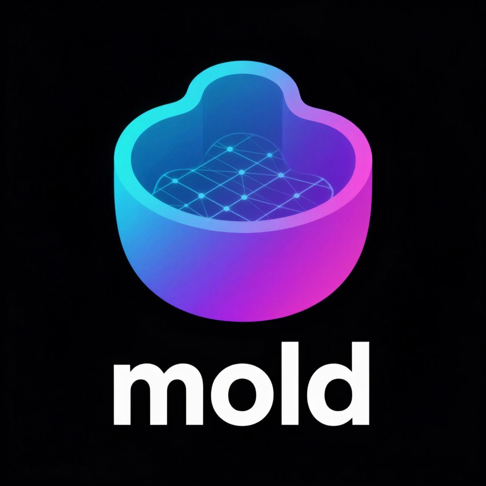

# mold

[](https://github.com/utensils/mold/actions/workflows/ci.yml)
[](https://www.rust-lang.org)
[](https://nixos.wiki/wiki/Flakes)

<p align="center">
  
</p>

Generate images from text on your own GPU. No cloud, no Python, no fuss.

```bash
mold run "a cat riding a motorcycle through neon-lit streets"
```

That's it. Mold auto-downloads the model on first run and saves the image to your current directory.

## Install

### Nix (recommended)

```bash
# Run directly — no install needed
nix run github:utensils/mold -- run "a cat"

# Or add to your system
nix profile install github:utensils/mold
```

### From source

```bash
cargo build --release -p mold-cli --features cuda    # Linux (NVIDIA)
cargo build --release -p mold-cli --features metal   # macOS (Apple Silicon)
```

## Usage

```bash
# Generate an image
mold run "a sunset over mountains"

# Pick a model
mold run flux-dev:q4 "a turtle in the desert"
mold run sdxl-turbo "espresso in a tiny cup"
mold run dreamshaper-v8 "fantasy castle on a cliff"

# Reproducible results (the logo above was generated this way)
mold run z-image-turbo:bf16 "A minimal modern logo for 'mold' on a solid black background. A stylized casting mold shape formed from smooth gradient lines transitioning from cyan to magenta. The negative space inside the mold reveals a glowing latent grid pattern suggesting AI diffusion. Bold lowercase 'mold' typography below in clean sans-serif. Flat vector style, no photorealism" --seed 1337

# Custom size and steps
mold run "a portrait" --width 768 --height 1024 --steps 30
```

### Piping

Mold is pipe-friendly in both directions. When stdout is not a terminal, raw image bytes go to stdout and status/progress goes to stderr.

```bash
# Pipe output to an image viewer
mold run "neon cityscape" | viu -

# Pipe prompt from stdin
echo "a cat riding a motorcycle" | mold run flux-schnell

# Chain with other tools
cat prompt.txt | mold run z-image-turbo --seed 42 | convert - -resize 512x512 thumbnail.png

# Pipe in and out
echo "cyberpunk samurai" | mold run flux-dev:q4 | viu -
```

### Image-to-image

Transform existing images with a text prompt:

```bash
# Stylize a photo
mold run "oil painting style" --image photo.png

# Control how much changes (0.0 = no change, 1.0 = full denoise)
mold run "watercolor" --image photo.png --strength 0.5

# Pipe an image through
cat photo.png | mold run "sketch style" --image - | viu -
```

### Inpainting

Selectively edit parts of an image with a mask (white = repaint, black = keep):

```bash
mold run "a red sports car" --image photo.png --mask mask.png
```

### ControlNet (SD1.5)

Guide generation with a control image (edge map, depth map, etc.):

```bash
mold pull controlnet-canny-sd15
mold run sd15:fp16 "a futuristic city" --control edges.png --control-model controlnet-canny-sd15
```

### Scheduler selection

Choose the noise scheduler for SD1.5/SDXL models:

```bash
mold run sd15:fp16 "a cat" --scheduler uni-pc        # Fast convergence
mold run sd15:fp16 "a cat" --scheduler euler-ancestral # Stochastic
```

### Batch generation

Generate multiple images with incrementing seeds:

```bash
mold run "a sunset" --batch 4    # Generates 4 images: seed, seed+1, seed+2, seed+3
```

### Manage models

```bash
mold pull flux-schnell:q8    # Download a model
mold list                    # See what you have
mold info flux-dev:q4        # Model details + disk usage
mold rm dreamshaper-v8       # Remove a model
```

### Remote rendering

Run mold on a beefy GPU server, generate from anywhere:

```bash
# On your GPU server
mold serve

# From your laptop
MOLD_HOST=http://gpu-server:7680 mold run "a cat"
```

## Models

### FLUX (best quality)

| Model | Steps | Size | Good for |
|-------|-------|------|----------|
| `flux-schnell:q8` | 4 | 12GB | Fast, general purpose |
| `flux-schnell:q4` | 4 | 7.5GB | Same but lighter |
| `flux-dev:q8` | 25 | 12GB | Full quality |
| `flux-dev:q4` | 25 | 7GB | Full quality, less VRAM |
| `flux-krea:q8` | 25 | 12.7GB | Aesthetic photography |

### SDXL (fast + flexible)

| Model | Steps | Size | Good for |
|-------|-------|------|----------|
| `sdxl-turbo:fp16` | 4 | 5.1GB | Ultra-fast, 1-4 steps |
| `dreamshaper-xl:fp16` | 8 | 5.1GB | Fantasy, concept art |
| `juggernaut-xl:fp16` | 30 | 5.1GB | Photorealism, cinematic |
| `realvis-xl:fp16` | 25 | 5.1GB | Photorealism, versatile |
| `playground-v2.5:fp16` | 25 | 5.1GB | Artistic, aesthetic |
| `sdxl-base:fp16` | 25 | 5.1GB | Official base model |

### SD 1.5 (lightweight)

| Model | Steps | Size | Good for |
|-------|-------|------|----------|
| `sd15:fp16` | 25 | 1.7GB | Base model, huge ecosystem |
| `dreamshaper-v8:fp16` | 25 | 1.7GB | Best all-around SD1.5 |
| `realistic-vision-v5:fp16` | 25 | 1.7GB | Photorealistic |

### SD 3.5

| Model | Steps | Size | Good for |
|-------|-------|------|----------|
| `sd3.5-large:q8` | 28 | 8.5GB | 8.1B params, high quality |
| `sd3.5-large:q4` | 28 | 5.0GB | Same, smaller footprint |
| `sd3.5-large-turbo:q8` | 4 | 8.5GB | Fast 4-step |
| `sd3.5-medium:q8` | 28 | 2.7GB | 2.5B params, efficient |

### Z-Image

| Model | Steps | Size | Good for |
|-------|-------|------|----------|
| `z-image-turbo:q8` | 9 | 6.6GB | Fast 9-step generation |
| `z-image-turbo:q4` | 9 | 3.8GB | Lighter, still good |
| `z-image-turbo:bf16` | 9 | 12.2GB | Full precision |

### Wuerstchen v2 (efficient cascade)

| Model | Steps | Size | Good for |
|-------|-------|------|----------|
| `wuerstchen-v2:fp16` | 60 | 5.6GB | 3-stage cascade, 42x compression |

### Flux.2 / Qwen-Image (beta)

| Model | Steps | Size | Good for |
|-------|-------|------|----------|
| `flux2-klein:bf16` | 28 | 13.5GB | Flux.2 Klein 4B distilled |
| `qwen-image:q8` | 28 | 21.8GB | Qwen-Image-2512 60-block |
| `qwen-image:q4` | 28 | 12.3GB | Qwen-Image, smallest footprint |

> Bare names default to `:q8` for FLUX/Z-Image or `:fp16` for SD1.5/SDXL. So `mold run flux-schnell "a cat"` just works.

## Server API

When running `mold serve`, you get a REST API:

```bash
# Generate an image
curl -X POST http://localhost:7680/api/generate \
  -H "Content-Type: application/json" \
  -d '{"prompt": "a glowing robot"}' \
  -o robot.png

# Check status
curl http://localhost:7680/api/status

# List models
curl http://localhost:7680/api/models

# Interactive docs
open http://localhost:7680/api/docs
```

## Shell completions

```bash
source <(mold completions bash)    # bash
source <(mold completions zsh)     # zsh
mold completions fish | source     # fish
```

## Requirements

- **NVIDIA GPU** with CUDA or **Apple Silicon** with Metal
- Models auto-download on first use (~2-30GB depending on model)

## How it works

Mold is a single Rust binary built on [candle](https://github.com/huggingface/candle) — a pure Rust ML framework. No Python runtime, no libtorch, no ONNX. Just your GPU doing math.

```
mold run "a cat"
  │
  ├─ Server running? → send request over HTTP
  │
  └─ No server? → load model locally on GPU
       ├─ Encode prompt (T5/CLIP text encoders)
       ├─ Denoise latent (transformer/UNet)
       ├─ Decode pixels (VAE)
       └─ Save PNG
```
