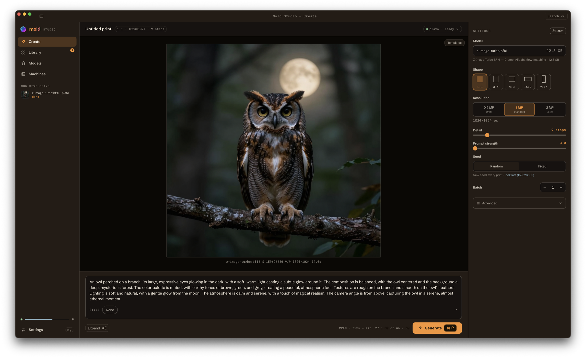
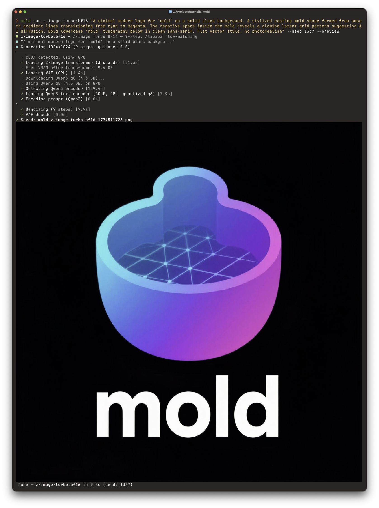
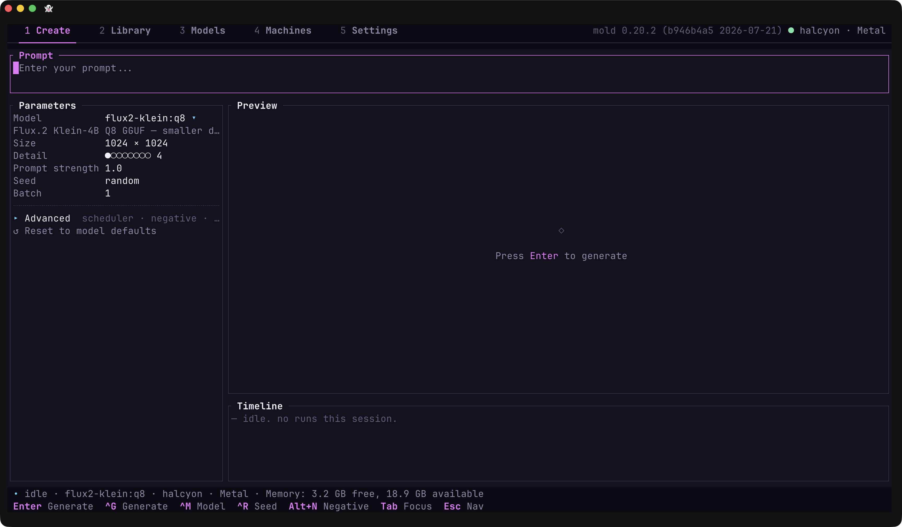

# mold

[](https://github.com/utensils/mold/actions/workflows/ci.yml)
[](https://codecov.io/gh/utensils/mold)
[](https://flakehub.com/flake/utensils/mold)
[](https://www.rust-lang.org)
[](https://nixos.wiki/wiki/Flakes)
[](https://utensils.io/mold/guide/cli-reference)
[](https://utensils.io/mold/guide/openclaw)
[](https://utensils.io/mold/api/)

Local AI image and video generation on your own GPU. Mold runs on NVIDIA CUDA
and Apple Silicon Metal with no Python, no cloud account, and no usage fees.

Mold began at the command line and remains **CLI-native**: every core workflow
is available as a composable command with predictable stdin, stdout, files, and
exit behavior. Use it interactively, script it in a pipeline, give it to an
agent, run it in CI, or build on the same engine through REST and SSE. The
desktop, web, TUI, and iPhone experiences are additional interfaces—not
replacements for the CLI foundation.

**[Documentation](https://utensils.io/mold/)** ·
**[Models](https://utensils.io/mold/models/)** ·
**[Desktop guide](https://utensils.io/mold/guide/desktop)** ·
**[API](https://utensils.io/mold/api/)**



## Mold Studio

Mold Studio brings local and remote generation into one native desktop app for
macOS and Linux:

- **Create** images, edits, upscales, and multi-stage videos with
  capability-aware controls, prompt expansion, batches, LoRAs, ControlNet, and
  reproducible seeds.
- **Library** merges prints from every connected machine into a fast,
  searchable gallery with saved prompts, settings, provenance, and native media
  actions, plus a remembered thumbnail-size control on web and desktop.
- **Models** discovers and installs checkpoints from Mold, Hugging Face, and
  Civitai, with live download progress and per-machine routing.
- **Machines** connects this device, LAN/Tailscale hosts, and RunPod while
  showing GPU telemetry, queues, downloads, and installed models.
- **Settings** includes Mold and Safelight themes, Stable/Nightly updates, local
  performance controls, and secure provider credentials.

**[Download Mold for macOS (Apple Silicon)](https://github.com/utensils/mold/releases/latest/download/Mold-macos-arm64.dmg)**
· [Explore the desktop app](https://utensils.io/mold/guide/desktop)

Mold also ships a responsive web studio with every `mold serve`, a
keyboard-first terminal UI, a REST/SSE API, and a remote iPhone companion.

## Install

```bash
curl -fsSL https://raw.githubusercontent.com/utensils/mold/main/install.sh | sh
```

The installer downloads the latest release to `~/.local/bin/mold`, selects the
right NVIDIA build on Linux, and installs the Metal build on macOS.

<details>
<summary>Other install options</summary>

```bash
# Nix — NVIDIA Ada / RTX 40-series
nix run github:utensils/mold -- run "a cat"

# Nix — NVIDIA Blackwell / RTX 50-series
nix run github:utensils/mold#mold-sm120 -- run "a cat"

# Arch Linux
paru -S mold-ai-bin

# Build from source on Linux
./scripts/ensure-web-dist.sh
cargo build --release -p mold-ai --features cuda

# Build from source on Apple Silicon
./scripts/ensure-web-dist.sh
cargo build --release -p mold-ai --features metal
```

Prebuilt binaries and checksums are available on the
[releases page](https://github.com/utensils/mold/releases/latest). See the
[installation guide](https://utensils.io/mold/guide/installation) for platform
details.

</details>

## Quick start

```bash
# Generate with the default model
mold run "a cat riding a motorcycle through neon-lit streets"

# Choose a model and reproducible seed
mold run flux-dev:q4 "a sunset over mountains" --seed 42

# Edit an image
mold run qwen-image-edit-2511:q4 "make the chair red" --image chair.png

# Generate video
mold run ltx-video-0.9.6-distilled:bf16 "a fox in the snow" --frames 25

# Launch the web studio and API
mold serve
```

Models download automatically on first use. Generated media is saved locally
with prompt, model, seed, and generation metadata.

## What it supports

- FLUX.1, Flux.2 Klein, SD 1.5, SDXL, SD 3.5, Z-Image, Qwen-Image,
  Qwen-Image-Edit, Wuerstchen v2, LTX Video, and LTX-2 / LTX-2.3
- Text-to-image, image-to-image, multimodal editing, inpainting, ControlNet,
  LoRA, prompt expansion, and Real-ESRGAN upscaling
- Text/image-to-video, multi-prompt video chains, native MP4 output, and
  checkpoint-dependent generated audio
- Sequence authoring inside Create with per-clip prompts, duration, source
  images, Smooth / Cut / Fade seams, resumable jobs, in-place editing that
  re-renders only the changed clips, and explicit remote-machine routing
- Quantized model variants, encoder fallback, smart VRAM placement, and FLUX
  block offloading
- Local CLI, native desktop, browser, TUI, iPhone, Discord, and authenticated
  REST/SSE clients

Browse the [model catalog](https://utensils.io/mold/models/) for sizes, VRAM
requirements, and recommended settings.

## More ways to create

Preview generations directly in supported terminals:

```bash
mold run "a cat" --preview
```

<p align="center">
  
  <br/>
  <em>Inline image generation in Ghostty with <code>--preview</code></em>
</p>

Or open the keyboard-first Mold Studio terminal interface:

```bash
mold tui
```

<p align="center">
  
  <br/>
  <em>The TUI Create workspace with a native terminal image preview</em>
</p>

## Remote and cloud GPUs

Run the engine where the GPU lives and use any Mold client over HTTP:

```bash
# GPU machine
mold serve

# Laptop or another client
MOLD_HOST=http://gpu-server:7680 mold run "a cat"
```

For managed cloud jobs, `mold runpod` can provision a GPU, reuse network
volumes, stream progress, and save the result locally. See the
[remote workflow](https://utensils.io/mold/guide/remote-workflows) and
[RunPod](https://utensils.io/mold/deployment/runpod-cli) guides.

## Project

Mold is a Rust workspace built on
[candle](https://github.com/huggingface/candle). Its CLI-native architecture
keeps the engine useful from a terminal, shell pipeline, agent, CI job, native
app, or custom client. The documentation covers the
[CLI](https://utensils.io/mold/guide/cli-reference),
[configuration](https://utensils.io/mold/guide/configuration),
[deployment](https://utensils.io/mold/deployment/), and
[HTTP API](https://utensils.io/mold/api/).

Core contributors:
[James Brink](https://jamesbrink.online/) and
[Jeffrey Dilley](mailto:jeff.dilley@gmail.com).

Licensed under the [MIT License](LICENSE).
