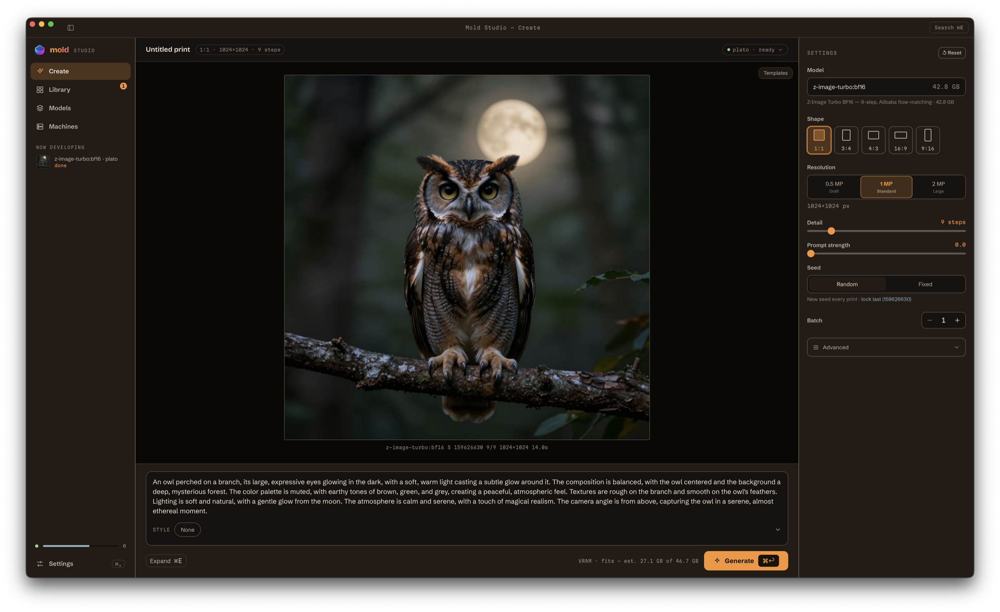
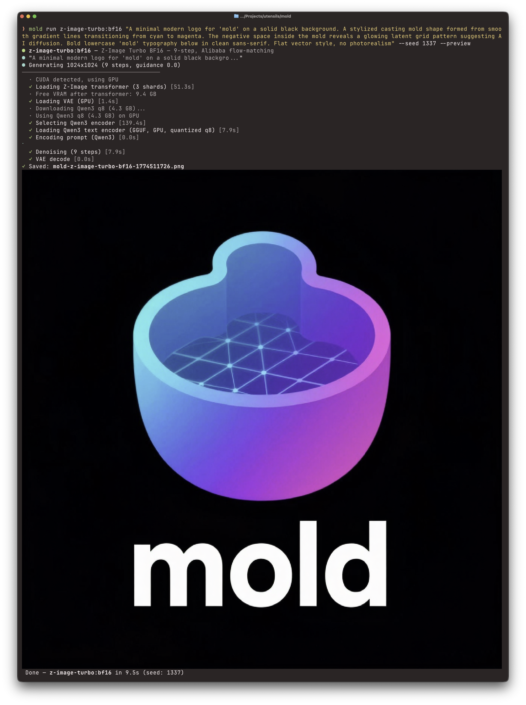

# mold

[](https://github.com/utensils/mold/actions/workflows/ci.yml)
[](https://codecov.io/gh/utensils/mold)
[](https://www.rust-lang.org)
[](https://nixos.wiki/wiki/Flakes)
[](https://utensils.io/mold/guide/cli-reference)
[](https://utensils.io/mold/guide/openclaw)
[](https://utensils.io/mold/api/)

Local AI image and video generation on your own GPU. Mold supports NVIDIA CUDA
and Apple Silicon Metal, with a CLI, native desktop app, web studio, mobile
companions, Discord bot, and REST/SSE API built on the same engine.

**[Documentation](https://utensils.io/mold/)** ·
**[Models](https://utensils.io/mold/models/)** ·
**[Desktop guide](https://utensils.io/mold/guide/desktop)** ·
**[API](https://utensils.io/mold/api/)**



## Install

Stable release:

```bash
curl -fsSL https://raw.githubusercontent.com/utensils/mold/main/install.sh | sh
```

Nightly CLI from the latest published `main` build:

```bash
curl -fsSL https://raw.githubusercontent.com/utensils/mold/main/install.sh | MOLD_CHANNEL=nightly sh
```

The installer selects a compatible build and verifies its checksum. Linux x86_64
clients without a visible NVIDIA GPU receive a GPU-free CLI. To use only remote
GPU hosts, including from a machine with NVIDIA hardware:

```bash
curl -fsSL https://raw.githubusercontent.com/utensils/mold/main/install.sh | MOLD_BACKEND=cpu sh
MOLD_HOST=http://gpu-server:7680 mold run "a cat"
```

The CPU archive needs no NVIDIA driver or CUDA libraries. Local GPU generation
requires a CUDA build (or Metal on macOS). See the
[installation guide](https://utensils.io/mold/guide/installation) for Nix,
Arch, Windows, Android, and source builds.
GH200, GB200, and GB300 require future linux/arm64 artifacts and are unsupported.

Mold no longer publishes new versions to crates.io. Existing registry versions
are historical; use GitHub releases, Nix, Docker, AUR, or a source build
for current versions.

## Quick start

```bash
# Generate with the default model
mold run "a cat riding a motorcycle through neon-lit streets"

# Choose a model and reproducible seed
mold run flux-dev:q4 "a sunset over mountains" --seed 42

# Edit an image
mold run qwen-image-edit-2511:q4 "make the chair red" --image chair.png

# Edit from reference images (repeat --reference; order is semantic)
mold run flux2-klein:bf16 "the woman from image 1 wearing the glasses from image 2" \
  --reference person.jpg --reference glasses.jpg

# Qwen Image 2.1: up to 10 ordered references, a transparent cut-out, or 6-step turbo
mold run qwen-image-2.1 "put the jacket from image 1 on the person in image 2" \
  --image jacket.png --image person.jpg
mold run qwen-image-2.1 "a red paper lantern with a gold tassel" --transparent -o lantern.png
mold run qwen-image-2.1-turbo "a lighthouse on a basalt cliff at dusk, oil painting"

# Generate video
mold run ltx-video-0.9.6-distilled:bf16 "a fox in the snow" --frames 25

# Turn a photo into a 3D mesh
mold run hunyuan3d-mini-turbo --image chair.png -o chair.glb
mold run hunyuan3d-2mv-turbo --front chair-front.png --left chair-left.png --back chair-back.png -o chair.glb

# Upscale a Library video as a durable framewise job
mold video-upscale create clip.mp4 --wait

# Launch the web studio and API
mold serve
```

Models download automatically on first use. Generated media is saved locally
with prompt, model, seed, and generation metadata.
Framewise video upscale also needs the host codec bridge: Nix packages and
CUDA containers include it, while raw binary installs must provide `ffmpeg`
and `ffprobe` on `PATH` before the server advertises that feature.

## What it supports

- **Models:** FLUX.1, Flux.2, Stable Diffusion, Z-Image, Qwen-Image,
  Qwen Image 2.1, Wuerstchen, LTX Video, Wan, MiniMax H3, and Hunyuan3D. See the
  [model catalog](https://utensils.io/mold/models/) for variants and hardware
  requirements.
  Wan's 1.3B BF16 and 5B Q8/FP16 paths are performance-qualified on Apple
  Metal as well as CUDA; fp8-scaled Wan checkpoints remain CUDA-only.
  MiniMax H3's compact runtime is supported on SM89 CUDA and Apple Metal;
  Metal admission checks each request against live unified-memory headroom.
  FL2VA requires at least one boundary frame: first, last, or both, with roughly 1,000
  prompt tokens with paired frames and charging their additional memory.
  Forced-local H3 execution accepts one FL2VA request; batches, sequences, and
  Ref2VA reference uploads require the server route.
  Qwen Image 2.1 (non-commercial Qwen Research License) edits from up to ten
  ordered references, renders transparent PNG/WebP cut-outs, runs native 2K
  presets, and ships BF16, INT8, FP8, GGUF and 6-step turbo tiers; its CUDA
  fast path is 2.5x faster at 1024² and 6x at 2K than v0.32.
- **Images:** text-to-image, image editing, inpainting, ControlNet, LoRA,
  identity photos, reference-image prompting, transparent backgrounds, prompt
  expansion, and upscaling, as PNG, JPEG or still WebP.
- **Video and audio:** text/image-to-video, sequences, clip continuation,
  lip dub, text-to-audio, and MP4 output with generated audio.
- **3D:** single-image and named multiview-to-mesh with Hunyuan3D 2.0 and 2.1,
  automatic background removal, optional highlight and lighting removal, and
  Hunyuan3D Paint PBR materials in CUDA builds. Shape transformers can be
  locally derived as qualified FP8/GGUF tiers with `mold quantize`, which
  registers the derived tier on the host that made it. Results are published to the Library as
  binary glTF with a rendered poster tile, exportable as OBJ, an OBJ+PBR ZIP, STL, or PLY, or
  shared as a turntable GIF, APNG, or WebP. Durable text-to-3D, supplied-mesh texturing, and mesh-rebuild workflows remain
  available through the API/CLI. Apps generate 3-D objects directly from supplied
  images in the main generation screen.
  Painted prints expose their base-color, metallic-roughness, and normal maps as
  independent, digest-checked Library downloads on web, desktop, and mobile.
- **Multiple machines:** connect local, LAN, Tailscale, and RunPod hosts, then
  route work and browse one combined Library.
- **Organization:** title, favorite, tag, collect, restore, and manage prints
  across the desktop and web apps.

Curated models use the same short manifest title throughout the apps and
`mold list`, such as **FLUX.1 Dev Q4**. The runnable ID (`flux-dev:q4`)
remains available for commands, saved settings, and API requests. Model files
keep their original names; third-party models keep their provider titles.

Model weights keep their own licenses. See each model page for terms and
current platform support.

## Mold Studio

| Platform                | Download                                                                                                                                            |
| ----------------------- | --------------------------------------------------------------------------------------------------------------------------------------------------- |
| **macOS (recommended)** | **[Mold Studio for Mac](https://github.com/utensils/mold/releases/latest/download/Mold-Studio-macos-arm64.dmg)** — native, Apple Silicon, macOS 26+ |
| macOS (legacy)          | [Mold Desktop (Tauri)](https://github.com/utensils/mold/releases/latest/download/Mold-macos-arm64.dmg) — for Macs that cannot run macOS 26          |
| Windows                 | [Mold Desktop (Tauri)](https://github.com/utensils/mold/releases/latest/download/Mold-windows-x64-self-signed.exe) — see below                      |
| Linux                   | Mold Desktop (Tauri) — source/CI builds, see below                                                                                                  |
| Android                 | [Nightly APK](https://github.com/utensils/mold/releases/download/latest/Mold-android.apk) — see below                                               |

**On a Mac, use Mold Studio.** It is the native macOS app: signed,
notarized, self-updating through Sparkle, with mold's own Metal engine built
in, and it talks to any `mold serve` on your network too. Generate, a merged
multi-machine Library, Queue, Models and Machines, all in one native window.
The Generate controls stay at the bottom; the Library can create a collection
from selected prints and hide collection members from general browsing across
all their machine copies. The native iOS companion shares collection hiding.
[Mold Studio for Mac guide](https://utensils.io/mold/guide/macos)

**[Download Mold Studio for Mac (Apple Silicon, macOS 26+)](https://github.com/utensils/mold/releases/latest/download/Mold-Studio-macos-arm64.dmg)**

It installs as **Mold Studio.app** beside the older Tauri app (`Mold.app`),
so both can live in /Applications while you move over. The Tauri app is now
the **legacy** Mac download — keep it only for a Mac that cannot run macOS 26:
[Download Mold Desktop for macOS (legacy)](https://github.com/utensils/mold/releases/latest/download/Mold-macos-arm64.dmg).

On Windows and Linux the Tauri desktop app remains the default. It puts New
image, Queue, My images, Styles, Machines, and Settings in one window, in plain
words, with six themes, for local and remote generation, and pairs with the
iPhone and Android companions.
[Explore the desktop app](https://utensils.io/mold/guide/desktop)

**[Download Mold for Windows (x86_64)](https://github.com/utensils/mold/releases/latest/download/Mold-windows-x64-self-signed.exe)**
— a self-signed NSIS installer. The published build is CPU / remote-hosts
only; see the [desktop guide](https://utensils.io/mold/guide/desktop) for the
CUDA recipe. Verify and explicitly trust the release's
`mold-windows-self-signing.cert.cer` before installing; the certificate is not
publicly trusted and does not suppress SmartScreen on its own.

Linux desktop builds are source/CI distributions for now — `nix build
.#mold-desktop` or the devshell's `desktop-build` CUDA AppImage. See the
[desktop guide](https://utensils.io/mold/guide/desktop).

On iPhone and iPad, **Mold Studio Companion** is the native app beside Mold
Studio for Mac: pair by scanning the Mac's code, generate on your machines,
and follow renders from the Lock Screen. Generation options adapt to large text,
and the full-screen viewer keeps its media actions accessible. It is in TestFlight while it is new.
[Mold Studio for iPhone & iPad guide](https://utensils.io/mold/guide/companion)

The native iOS companion uses concise render notifications with its app icon; tapping opens the finished print from the background or a cold launch, with notification activation completed on the main thread. Library long-press and drag previews retain their thumbnail loader, and source selection prefers a reachable machine copy; the notification icon keeps the same authored colors in light and dark appearances. Its Live Activity uses the system background material with matching semantic text, a full-width progress row, and a separate machine/queue footer. Generate Options marks the selected aspect with a checkmark; attaching the first/start frame chooses the closest supported aspect, and a closing frame preserves it. Options shows proportionate aspect icons, source-image fitting (centered Crop to fill by default), and an explicit Random seed default.

The native iOS companion offers **Open Settings** recovery for denied Photos,
camera, nearby-network, notification and Live Activity access. Photos saving uses
add-only authorization and safely writes pictures and videos; photo imports use
the system picker. See the [native permission audit](apps/ios/docs/PERMISSIONS.md).

The native iOS Library keeps its offline notice compact and offers scrollable details with every full machine name, preserving room for saved prints at large text sizes. Decorative Library badges stay within their tiles; the full machine names remain in accessibility labels and Info.

The native iOS Models screen offers visible per-model Unload and Unload All Models controls for the selected server; unloading keeps downloaded files.

Native iOS development: `nix develop -c companion-dev` watches Swift sources,
builds and relaunches in Simulator. `companion-run` launches once; see the
[native iOS developer guide](apps/ios/README.md) for simulator and build-directory overrides.

Android uses the same remote-only Mold Studio mobile interface. Download the
signed universal nightly APK directly; there is no zip to unpack:

**[Download nightly Android APK](https://github.com/utensils/mold/releases/download/latest/Mold-android.apk)**
· [Android installation guide](https://utensils.io/mold/guide/android)

## More ways to create

Preview generations directly in supported terminals:

```bash
mold run "a cat" --preview
```

<p align="center">
  
  <br/>
  <em>Inline image generation in Ghostty with <code>--preview</code></em>
</p>

Run the engine where the GPU lives and connect from another machine:

```bash
mold serve                                      # GPU machine
MOLD_HOST=http://gpu-server:7680 mold run "a cat"  # laptop
```

For access outside your network without opening the GPU host's inbound ports,
use the optional [HTTPS reverse relay](https://utensils.io/mold/deployment/relay).
Run `mold relay connect --transport aws` beside an authenticated server; every client uses the
resulting HTTPS machine address with its existing API key or pairing flow.
The trusted Lambda gateway can see traffic and publishes one machine per address.
Authenticated servers allow their browser shell/assets to load before sign-in;
API and media access still require their existing permissions.

`--offload` also applies to remote renders and durable sequences on GPU hosts.
Add `--no-save` to keep one render out of a server's Library; the host still
publishes the print and moves it straight to trash, so `mold trash restore`
gets it back until retention sweeps it. It applies to renders a server
performs — a local render has no Library, and refuses the flag rather than
ignoring it.

Pass `--fit` beside `--image` when the source and the canvas disagree. Without
it the picture decides the canvas; with it the canvas is what you asked for and
the picture is resampled onto it — `crop-fill` trims the edges, `pad-fit` adds
black borders, `lanczos-resize` stretches.

```bash
mold run flux-dev:q4 "a lighthouse at dusk" --image wide.png --fit crop-fill --width 1024 --height 1024
```

A sequence of several clips is scripted, not composed in an app:

```bash
mold chain validate shot.toml
mold run --script shot.toml --output walk.mp4
mold jobs list
```

A 3-D render can be one shot or a durable workflow. A workflow keeps every
stage — the picture it starts from, its matted and delighted copies, the
shape, the paint — as its own retained artifact, reports each stage as it
changes state, and resumes after a restart. It lives on the machine that runs it:

```bash
mold mesh-workflow create --prompt "a small ceramic fox" --texture --follow
mold mesh-workflow create --mesh chair.glb --image chair-albedo.png
mold mesh-workflow list
```

Find weights to install, and watch them arrive:

```bash
mold search "anime style" --kind lora
mold pull flux-dev:q4
mold downloads watch
```

See the [remote workflow](https://utensils.io/mold/guide/remote-workflows) and
[RunPod](https://utensils.io/mold/deployment/runpod-cli) guides. Use
`mold queue` to manage remote work and `mold library` to browse and organize
the host's prints, including `mold library source-media` to recover the
conditioning image a print was made from and `mold trash delete` to remove one
permanently. Retained sources survive queue cleanup and remain available while
any referencing library output exists, including in the trash. Matching retained
input sets from newly completed jobs share storage while keeping per-job
provenance. Native Mac and
desktop library copies also retain those sources on supported destinations.
Native Mac mirrors accept missing archive-only job IDs and generation durations, and a short version matching the same version with a build suffix. Output bytes and all generation settings must still match; conflicting recorded provenance is refused. Retrying Sync All repairs retained inputs on compatible existing copies without duplicating their outputs.

Native Mac shipping builds include the reviewed Metal H3 runtime. Remote generation follows the selected host’s capabilities. Reused native Mac references show bounded previews and survive ordinary control edits and repeated submissions; relaunch verifies their byte-free origin locator before enabling Generate.

Before importing a source-bearing copy, clients check destination readiness. Windows local destinations currently cannot receive retained inputs, so those copies are refused before creating a local library output. Source-free copies remain supported, and Windows clients can recall retained sources from a supported remote machine.
To install Mold's Agent Skill for supported coding agents,
run:

```bash
mold skill install --detected
```

The installed bundle uses each agent's native metadata and discovery contract,
with a concise router, safety guidance, tested examples, and the prompting
corpus: a shared guide, one complete base guide per manifest family (prompt
style, syntax, generation context, examples, pitfalls, and that family's CLI
examples), task leaves for the distinct H3, Wan, and LTX-2 grammars, and model
leaves for checkpoints with quirks of their own. The corpus in
`crates/mold-core/src/prompting/` is also what `mold expand`, `mold remix`,
`--expand`, the app Expand and Remix actions, and the MCP `expand_prompt` /
`remix_prompt` tools hand to the LLM, together with the exact model, canvas,
frame count, fps, and ordered references, so agents and the expander follow one
set of rules. Hunyuan3D's base guide is the one that tells an agent NOT to
write a prompt.

## macOS Metal memory

Use `mold system metal-memory status` to inspect this Mac, or `mold gpu list --json`
for a running host. Explicit root-only `set <MiB>` / `reset` commands support an
optional boot policy with `--persist`. See the [Metal memory guide](website/guide/metal-memory.md)
for budget accounting, local-only administration and rollback semantics.
Z-Image's Metal whole-decode path retries with tiles on memory errors and
preserves the eager CPU fallback. CPU/CUDA decode ordering is unchanged; see
the [VAE qualification record](docs/qualification/zimage-metal-vae.md).

## Project

Mold is a Rust workspace built on
[candle](https://github.com/huggingface/candle). The documentation covers the
[CLI](https://utensils.io/mold/guide/cli-reference),
[configuration](https://utensils.io/mold/guide/configuration),
[deployment](https://utensils.io/mold/deployment/), and
[HTTP API](https://utensils.io/mold/api/).

Core contributors:
[James Brink](https://jamesbrink.online/) and
[Jeffrey Dilley](mailto:jeff.dilley@gmail.com).

Licensed under the [MIT License](LICENSE). Third-party components and model
licenses are listed in [THIRD_PARTY_NOTICES.md](THIRD_PARTY_NOTICES.md) and the
[model documentation](https://utensils.io/mold/models/). InsightFace identity
weights require separate acceptance and are limited to non-commercial research
use.

Model checksums are verified when files are downloaded. Complete installed models queue and switch without full checksum scans, including after restart. To check existing bytes explicitly, run `mold info MODEL --verify`. Normal loading still checks file sizes and formats; it does not guarantee detection of same-size corruption.

The [public website privacy policy](https://utensils.io/mold/privacy) describes
Google Analytics on the documentation website. Analytics loads automatically
without a popup; this integration is not included in Mold apps or servers.

Native iOS and macOS Libraries offer All Media, Photos, Videos and 3D filters
within each shelf. iOS Select supports finger sweeps across a range, including
edge scrolling, and keeps the viewport stable when selecting.

Native macOS **Settings ▸ Remote Access**, beside Machines, offers **Pair your
phone** in the existing first section, alongside the connection address and
paired-device controls. Scan its QR in the native iOS app or Tauri mobile app.
Saved machines advertise only routes their listener actually serves: phone
clients prefer LAN, then Tailscale, with HTTPS proxy fallback after an
instance-bound credential-free proof. This Mac's loopback listener advertises
only its prepared managed HTTPS origin. An existing paired machine keeps its
identity and credential as routes change. For an independently hosted server,
configure `MOLD_PUBLIC_URL` to advertise its actual public HTTPS relay origin.

Automatic roaming requires a server-minted paired credential. Operator API keys
remain tied to the explicitly saved address; pair once to enable route learning.
Probes expose a stable digest tag, so arbitrary operator keys never participate
in anonymous route proofs. Plain HTTP still requires a trusted network.

Native iOS queue cards use concise curated model names and open full job details
on tap, with state-aware per-job controls. Generate exposes searchable per-machine
Prompt History with prompt-only recall.

Native iOS and macOS generation controls support ordered MiniMax H3 image/video/audio references, Hunyuan3D named views, and Wan/MiniMax boundary frames. See the [native reference parity audit](docs/plans/native-reference-parity.md) and native app guides for limits and media formats.

### Media export controls

Native iOS and Tauri offer clip GIF exports with Loop/Bounce, Forever/Once,
size, frame rate and, on supporting hosts, an extra boundary pause. Set the
pause to **0 ms** to add no hold to a continuous source loop. GIF frame timing
remains FPS-derived; a pause does not repair a discontinuity in the source.
Native iOS also exports host-advertised mesh formats, turntables and texture
sidecars to Share, Files or its Mold folder, with GIF delivery to Photos.
See [native export coverage](apps/ios/docs/MEDIA-EXPORT-PARITY.md).
